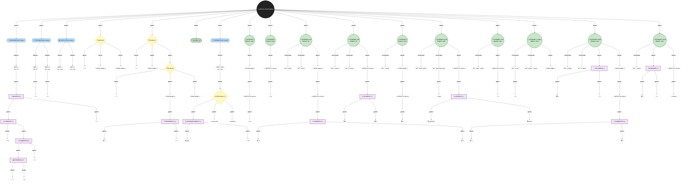

```mermaid
%%{init: { 'theme': 'base', 'themeVariables': { 'primaryColor': '#ffffff', 'primaryTextColor': '#000000', 'lineColor': '#333333' }, 'graph': {'rankSep': 120, 'nodeSep': 100}} }%%
graph TD
  classDef root_style fill:#222,color:#fff,stroke:#000,stroke-width:4px;
  classDef var_style fill:#bbdefb,color:#000,stroke:#1565c0,stroke-width:2px;
  classDef op_style fill:#f3e5f5,color:#000,stroke:#7b1fa2,stroke-width:2px;
  classDef logic_style fill:#fff9c4,color:#000,stroke:#fbc02d,stroke-width:2px;
  classDef func_style fill:#c8e6c9,color:#000,stroke:#2e7d32,stroke-width:2px;
  node_0(("   🚀 КОРЕНЬ ПРОГРАММЫ   " ))
  class node_0 root_style
  node_1{{"   📝 ПЕРЕМЕННЫЕ (make)   " }}
  node_0 -- " <font color='black'><b>далее</b></font> " ----> node_1
  class node_1 var_style
  node_2(["   ИМЯ: s
Тип: Int   " ])
  node_1 -- " <font color='black'><b>память</b></font> " ----> node_2
  node_3["   ➖ ВЫЧЕСТЬ (-)    " ]
  node_2 -- " <font color='black'><b>далее</b></font> " ----> node_3
  class node_3 op_style
  node_4["   ➕ СЛОЖИТЬ (+)    " ]
  node_3 -- " <font color='black'><b>далее</b></font> " ----> node_4
  class node_4 op_style
  node_5["   💎 10   "]
  node_4 -- " <font color='black'><b>далее</b></font> " ----> node_5
  node_6["   ➗ РАЗДЕЛИТЬ (/)    " ]
  node_4 -- " <font color='black'><b>далее</b></font> " ----> node_6
  class node_6 op_style
  node_7["   ✖️ УМНОЖИТЬ (*)    " ]
  node_6 -- " <font color='black'><b>далее</b></font> " ----> node_7
  class node_7 op_style
  node_8["   💎 4   "]
  node_7 -- " <font color='black'><b>далее</b></font> " ----> node_8
  node_9["   💎 8   "]
  node_7 -- " <font color='black'><b>далее</b></font> " ----> node_9
  node_10["   💎 9   "]
  node_6 -- " <font color='black'><b>далее</b></font> " ----> node_10
  node_11["   💎 2   "]
  node_3 -- " <font color='black'><b>далее</b></font> " ----> node_11
  node_12{{"   📝 ПЕРЕМЕННЫЕ (make)   " }}
  node_0 -- " <font color='black'><b>далее</b></font> " ----> node_12
  class node_12 var_style
  node_13(["   ИМЯ: s
Тип: Int   " ])
  node_12 -- " <font color='black'><b>память</b></font> " ----> node_13
  node_14["   💎 9   "]
  node_13 -- " <font color='black'><b>далее</b></font> " ----> node_14
  node_15(["   ИМЯ: s1
Тип: auto   " ])
  node_12 -- " <font color='black'><b>память</b></font> " ----> node_15
  node_16["   💎 0   "]
  node_15 -- " <font color='black'><b>далее</b></font> " ----> node_16
  node_17{{"   🔒 КОНСТАНТЫ (make)   " }}
  node_0 -- " <font color='black'><b>далее</b></font> " ----> node_17
  class node_17 var_style
  node_18(["   ИМЯ: s
Тип: auto   " ])
  node_17 -- " <font color='black'><b>память</b></font> " ----> node_18
  node_19(["   ИМЯ: s
Тип: auto   " ])
  node_17 -- " <font color='black'><b>память</b></font> " ----> node_19
  node_20{"   ❓ ЕСЛИ (if)   " }
  node_0 -- " <font color='black'><b>далее</b></font> " ----> node_20
  class node_20 logic_style
  node_21["   💎 0   "]
  node_20 -- " <font color='black'><b>далее</b></font> " ----> node_21
  node_22["   📂 БЛОК КОДА { }   " ]
  node_20 -- " <font color='black'><b>далее</b></font> " ----> node_22
  node_23["   📂 БЛОК КОДА { }   " ]
  node_20 -- " <font color='black'><b>далее</b></font> " ----> node_23
  node_24{"   ❓ ЕСЛИ (if)   " }
  node_0 -- " <font color='black'><b>далее</b></font> " ----> node_24
  class node_24 logic_style
  node_25["   💎 1   "]
  node_24 -- " <font color='black'><b>далее</b></font> " ----> node_25
  node_26["   📂 БЛОК КОДА { }   " ]
  node_24 -- " <font color='black'><b>далее</b></font> " ----> node_26
  node_27{"   ❓ ЕСЛИ (if)   " }
  node_24 -- " <font color='black'><b>далее</b></font> " ----> node_27
  class node_27 logic_style
  node_28["   💎 1   "]
  node_27 -- " <font color='black'><b>далее</b></font> " ----> node_28
  node_29["   📂 БЛОК КОДА { }   " ]
  node_27 -- " <font color='black'><b>далее</b></font> " ----> node_29
  node_30["   ⬅️ ПРИСВОИТЬ (=)    " ]
  node_29 -- " <font color='black'><b>далее</b></font> " ----> node_30
  class node_30 op_style
  node_31(["   🔍 s   " ])
  node_30 -- " <font color='black'><b>далее</b></font> " ----> node_31
  node_32["   💎 0   "]
  node_30 -- " <font color='black'><b>далее</b></font> " ----> node_32
  node_33["   📂 БЛОК КОДА { }   " ]
  node_27 -- " <font color='black'><b>далее</b></font> " ----> node_33
  node_34(["   🚀 ВЫЗОВ: s()   " ])
  node_0 -- " <font color='black'><b>далее</b></font> " ----> node_34
  class node_34 func_style
  node_35{{"   📝 ПЕРЕМЕННЫЕ (make)   " }}
  node_0 -- " <font color='black'><b>далее</b></font> " ----> node_35
  class node_35 var_style
  node_36(["   ИМЯ: status
Тип: auto   " ])
  node_35 -- " <font color='black'><b>память</b></font> " ----> node_36
  node_37{"   ⚖️ ТЕРНАРКА (?:)   " }
  node_36 -- " <font color='black'><b>далее</b></font> " ----> node_37
  class node_37 logic_style
  node_38["   📈 БОЛЬШЕ-РАВНО (>=)    " ]
  node_37 -- " <font color='black'><b>далее</b></font> " ----> node_38
  class node_38 op_style
  node_39(["   🔍 age   " ])
  node_38 -- " <font color='black'><b>далее</b></font> " ----> node_39
  node_40["   💎 18   "]
  node_38 -- " <font color='black'><b>далее</b></font> " ----> node_40
  node_41["   💎 взрослый   "]
  node_37 -- " <font color='black'><b>далее</b></font> " ----> node_41
  node_42["   💎 ребёнок   "]
  node_37 -- " <font color='black'><b>далее</b></font> " ----> node_42
  node_43(("   🔨 ФУНКЦИЯ: f
Вернет: auto   " ))
  node_0 -- " <font color='black'><b>далее</b></font> " ----> node_43
  class node_43 func_style
  node_44["   📂 БЛОК КОДА { }   " ]
  node_43 -- " <font color='black'><b>далее</b></font> " ----> node_44
  node_45[/"   ↩️ ВЕРНУТЬ (return)   " /]
  node_44 -- " <font color='black'><b>далее</b></font> " ----> node_45
  node_46["   💎 42   "]
  node_45 -- " <font color='black'><b>далее</b></font> " ----> node_46
  node_47(("   🔨 ФУНКЦИЯ: f
Вернет: auto   " ))
  node_0 -- " <font color='black'><b>далее</b></font> " ----> node_47
  class node_47 func_style
  node_48[/"   ↩️ ВЕРНУТЬ (return)   " /]
  node_47 -- " <font color='black'><b>далее</b></font> " ----> node_48
  node_49["   💎 42   "]
  node_48 -- " <font color='black'><b>далее</b></font> " ----> node_49
  node_50(("   🔨 ФУНКЦИЯ: add
Вернет: Int   " ))
  node_0 -- " <font color='black'><b>далее</b></font> " ----> node_50
  class node_50 func_style
  node_51(["   АРГ: a (Int)   " ])
  node_50 -- " <font color='black'><b>сигнатура</b></font> " ----> node_51
  node_52(["   АРГ: b (Int)   " ])
  node_50 -- " <font color='black'><b>сигнатура</b></font> " ----> node_52
  node_53["   📂 БЛОК КОДА { }   " ]
  node_50 -- " <font color='black'><b>далее</b></font> " ----> node_53
  node_54[/"   ↩️ ВЕРНУТЬ (return)   " /]
  node_53 -- " <font color='black'><b>далее</b></font> " ----> node_54
  node_55["   ➕ СЛОЖИТЬ (+)    " ]
  node_54 -- " <font color='black'><b>далее</b></font> " ----> node_55
  class node_55 op_style
  node_56(["   🔍 a   " ])
  node_55 -- " <font color='black'><b>далее</b></font> " ----> node_56
  node_57(["   🔍 b   " ])
  node_55 -- " <font color='black'><b>далее</b></font> " ----> node_57
  node_58(("   🔨 ФУНКЦИЯ: add
Вернет: Int   " ))
  node_0 -- " <font color='black'><b>далее</b></font> " ----> node_58
  class node_58 func_style
  node_59(["   АРГ: a (auto)   " ])
  node_58 -- " <font color='black'><b>сигнатура</b></font> " ----> node_59
  node_60(["   АРГ: b (auto)   " ])
  node_58 -- " <font color='black'><b>сигнатура</b></font> " ----> node_60
  node_61[/"   ↩️ ВЕРНУТЬ (return)   " /]
  node_58 -- " <font color='black'><b>далее</b></font> " ----> node_61
  node_62["   ➕ СЛОЖИТЬ (+)    " ]
  node_61 -- " <font color='black'><b>далее</b></font> " ----> node_62
  class node_62 op_style
  node_63(["   🔍 a   " ])
  node_62 -- " <font color='black'><b>далее</b></font> " ----> node_63
  node_64(["   🔍 b   " ])
  node_62 -- " <font color='black'><b>далее</b></font> " ----> node_64
  node_65(("   🔨 ФУНКЦИЯ: f
Вернет: auto   " ))
  node_0 -- " <font color='black'><b>далее</b></font> " ----> node_65
  class node_65 func_style
  node_66(["   АРГ: x (auto)   " ])
  node_65 -- " <font color='black'><b>сигнатура</b></font> " ----> node_66
  node_67["   📂 БЛОК КОДА { }   " ]
  node_65 -- " <font color='black'><b>далее</b></font> " ----> node_67
  node_68[/"   ↩️ ВЕРНУТЬ (return)   " /]
  node_67 -- " <font color='black'><b>далее</b></font> " ----> node_68
  node_69(["   🔍 x   " ])
  node_68 -- " <font color='black'><b>далее</b></font> " ----> node_69
  node_70(("   🔨 ФУНКЦИЯ: greet
Вернет: auto   " ))
  node_0 -- " <font color='black'><b>далее</b></font> " ----> node_70
  class node_70 func_style
  node_71(["   АРГ: name (auto)   " ])
  node_70 -- " <font color='black'><b>сигнатура</b></font> " ----> node_71
  node_72(["   АРГ: greeting (auto)   " ])
  node_70 -- " <font color='black'><b>сигнатура</b></font> " ----> node_72
  node_73["   💎 Hello   "]
  node_72 -- " <font color='black'><b>далее</b></font> " ----> node_73
  node_74[/"   ↩️ ВЕРНУТЬ (return)   " /]
  node_70 -- " <font color='black'><b>далее</b></font> " ----> node_74
  node_75["   ➕ СЛОЖИТЬ (+)    " ]
  node_74 -- " <font color='black'><b>далее</b></font> " ----> node_75
  class node_75 op_style
  node_76(["   🔍 greeting   " ])
  node_75 -- " <font color='black'><b>далее</b></font> " ----> node_76
  node_77(["   🔍 name   " ])
  node_75 -- " <font color='black'><b>далее</b></font> " ----> node_77
  node_78(("   🔨 ФУНКЦИЯ: sum
Вернет: auto   " ))
  node_0 -- " <font color='black'><b>далее</b></font> " ----> node_78
  class node_78 func_style
  node_79(["   АРГ: args... (auto)   " ])
  node_78 -- " <font color='black'><b>сигнатура</b></font> " ----> node_79
  node_80[/"   ↩️ ВЕРНУТЬ (return)   " /]
  node_78 -- " <font color='black'><b>далее</b></font> " ----> node_80
  node_81["   💎 0   "]
  node_80 -- " <font color='black'><b>далее</b></font> " ----> node_81
  node_82(("   🔨 ФУНКЦИЯ: complex
Вернет: auto   " ))
  node_0 -- " <font color='black'><b>далее</b></font> " ----> node_82
  class node_82 func_style
  node_83(["   АРГ: a (Int)   " ])
  node_82 -- " <font color='black'><b>сигнатура</b></font> " ----> node_83
  node_84["   💎 0   "]
  node_83 -- " <font color='black'><b>далее</b></font> " ----> node_84
  node_85(["   АРГ: others... (auto)   " ])
  node_82 -- " <font color='black'><b>сигнатура</b></font> " ----> node_85
  node_86["   📂 БЛОК КОДА { }   " ]
  node_82 -- " <font color='black'><b>далее</b></font> " ----> node_86
  node_87(("   🔨 ФУНКЦИЯ: divide
Вернет: auto   " ))
  node_0 -- " <font color='black'><b>далее</b></font> " ----> node_87
  class node_87 func_style
  node_88(["   АРГ: a (auto)   " ])
  node_87 -- " <font color='black'><b>сигнатура</b></font> " ----> node_88
  node_89(["   АРГ: b (auto)   " ])
  node_87 -- " <font color='black'><b>сигнатура</b></font> " ----> node_89
  node_90["   🚫 НЕ РАВНО (!=)    " ]
  node_87 -- " <font color='black'><b>далее</b></font> " ----> node_90
  class node_90 op_style
  node_91(["   🔍 b   " ])
  node_90 -- " <font color='black'><b>далее</b></font> " ----> node_91
  node_92["   💎 0   "]
  node_90 -- " <font color='black'><b>далее</b></font> " ----> node_92
  node_93["   📂 БЛОК КОДА { }   " ]
  node_87 -- " <font color='black'><b>далее</b></font> " ----> node_93
  node_94[/"   ↩️ ВЕРНУТЬ (return)   " /]
  node_93 -- " <font color='black'><b>далее</b></font> " ----> node_94
  node_95["   ➗ РАЗДЕЛИТЬ (/)    " ]
  node_94 -- " <font color='black'><b>далее</b></font> " ----> node_95
  class node_95 op_style
  node_96(["   🔍 a   " ])
  node_95 -- " <font color='black'><b>далее</b></font> " ----> node_96
  node_97(["   🔍 b   " ])
  node_95 -- " <font color='black'><b>далее</b></font> " ----> node_97
  node_98(("   🔨 ФУНКЦИЯ: check
Вернет: auto   " ))
  node_0 -- " <font color='black'><b>далее</b></font> " ----> node_98
  class node_98 func_style
  node_99(["   АРГ: x (auto)   " ])
  node_98 -- " <font color='black'><b>сигнатура</b></font> " ----> node_99
  node_100["   📈 БОЛЬШЕ (>)    " ]
  node_98 -- " <font color='black'><b>далее</b></font> " ----> node_100
  class node_100 op_style
  node_101(["   🔍 x   " ])
  node_100 -- " <font color='black'><b>далее</b></font> " ----> node_101
  node_102["   💎 0   "]
  node_100 -- " <font color='black'><b>далее</b></font> " ----> node_102
  node_103[/"   ↩️ ВЕРНУТЬ (return)   " /]
  node_98 -- " <font color='black'><b>далее</b></font> " ----> node_103
  node_104["   💎 Positive   "]
  node_103 -- " <font color='black'><b>далее</b></font> " ----> node_104
```
