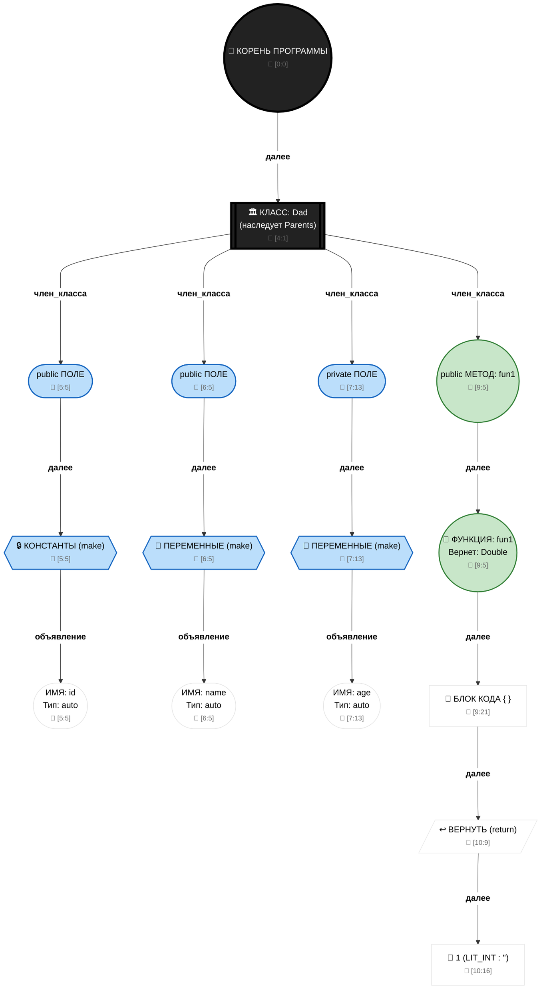

```mermaid
%%{init: { 'theme': 'base', 'themeVariables': { 'primaryColor': '#ffffff', 'primaryTextColor': '#000000', 'lineColor': '#333333' }, 'graph': {'rankSep': 120, 'nodeSep': 100}} }%%
graph TD
  classDef root_style fill:#222,color:#fff,stroke:#000,stroke-width:4px;
  classDef var_style fill:#bbdefb,color:#000,stroke:#1565c0,stroke-width:2px;
  classDef op_style fill:#f3e5f5,color:#000,stroke:#7b1fa2,stroke-width:2px;
  classDef logic_style fill:#fff9c4,color:#000,stroke:#fbc02d,stroke-width:2px;
  classDef func_style fill:#c8e6c9,color:#000,stroke:#2e7d32,stroke-width:2px;
  classDef test_style fill:#ffe0b2,color:#000,stroke:#fb8c00,stroke-width:2px;
  classDef assert_style fill:#ffcdd2,color:#000,stroke:#e53935,stroke-width:2px;
  node_0(("   🚀 КОРЕНЬ ПРОГРАММЫ
<font size='2' color='#666'>📍 [0:0]</font>   " ))
  class node_0 root_style
  node_1[["   🏛️ КЛАСС: Dad
(наследует Parents)
<font size='2' color='#666'>📍 [4:1]</font>   " ]]
  node_0 -- " <font color='black'><b>далее</b></font> " ----> node_1
  class node_1 root_style
  node_2(["    public ПОЛЕ
<font size='2' color='#666'>📍 [5:5]</font>   " ])
  node_1 -- " <font color='black'><b>член_класса</b></font> " ----> node_2
  class node_2 var_style
  node_3{{"   🔒 КОНСТАНТЫ (make)
<font size='2' color='#666'>📍 [5:5]</font>   " }}
  node_2 -- " <font color='black'><b>далее</b></font> " ----> node_3
  class node_3 var_style
  node_4(["   ИМЯ: id
Тип: auto
<font size='2' color='#666'>📍 [5:5]</font>   " ])
  node_3 -- " <font color='black'><b>объявление</b></font> " ----> node_4
  node_5(["    public ПОЛЕ
<font size='2' color='#666'>📍 [6:5]</font>   " ])
  node_1 -- " <font color='black'><b>член_класса</b></font> " ----> node_5
  class node_5 var_style
  node_6{{"   📝 ПЕРЕМЕННЫЕ (make)
<font size='2' color='#666'>📍 [6:5]</font>   " }}
  node_5 -- " <font color='black'><b>далее</b></font> " ----> node_6
  class node_6 var_style
  node_7(["   ИМЯ: name
Тип: auto
<font size='2' color='#666'>📍 [6:5]</font>   " ])
  node_6 -- " <font color='black'><b>объявление</b></font> " ----> node_7
  node_8(["    private ПОЛЕ
<font size='2' color='#666'>📍 [7:13]</font>   " ])
  node_1 -- " <font color='black'><b>член_класса</b></font> " ----> node_8
  class node_8 var_style
  node_9{{"   📝 ПЕРЕМЕННЫЕ (make)
<font size='2' color='#666'>📍 [7:13]</font>   " }}
  node_8 -- " <font color='black'><b>далее</b></font> " ----> node_9
  class node_9 var_style
  node_10(["   ИМЯ: age
Тип: auto
<font size='2' color='#666'>📍 [7:13]</font>   " ])
  node_9 -- " <font color='black'><b>объявление</b></font> " ----> node_10
  node_11(("    public МЕТОД: fun1
<font size='2' color='#666'>📍 [9:5]</font>   " ))
  node_1 -- " <font color='black'><b>член_класса</b></font> " ----> node_11
  class node_11 func_style
  node_12(("   🔨 ФУНКЦИЯ: fun1
Вернет: Double
<font size='2' color='#666'>📍 [9:5]</font>   " ))
  node_11 -- " <font color='black'><b>далее</b></font> " ----> node_12
  class node_12 func_style
  node_13["   📂 БЛОК КОДА { }
<font size='2' color='#666'>📍 [9:21]</font>   " ]
  node_12 -- " <font color='black'><b>далее</b></font> " ----> node_13
  node_14[/"   ↩️ ВЕРНУТЬ (return)
<font size='2' color='#666'>📍 [10:9]</font>   " /]
  node_13 -- " <font color='black'><b>далее</b></font> " ----> node_14
  node_15["   💎 1 (LIT_INT : '')
<font size='2' color='#666'>📍 [10:16]</font>   "]
  node_14 -- " <font color='black'><b>далее</b></font> " ----> node_15
```
